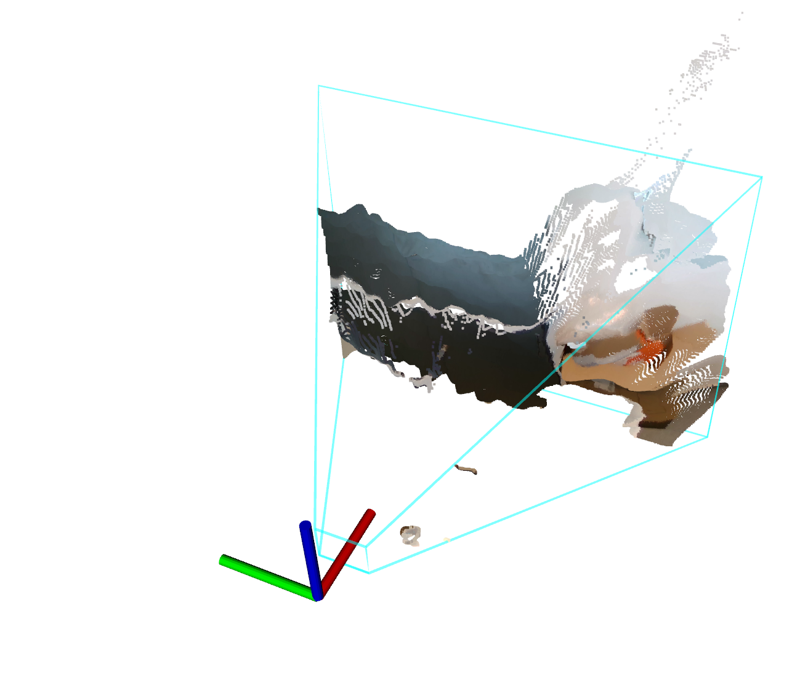

# ipa_3d_fov_visualization
This package visualizes the field of view (FOV) form stereo cameras using the pinhole model.

## Requirements:
1. System with Ubuntu and ROS http://wiki.ros.org (testet with ROS-Kinetic)
1. Stereo Camera (testet with Intel RealSense D435)

## Usage:

1. Adapt ROS-Topics of the Camera Info in launch-File. e.g. `<remap from="camera_info" to="camera/color/camera_info"/>`
1. Set Parameters in launch file
1. How to start? `roslaunch ipa_3d_fov_visualization ipa_3d_fov_visualization.launch`

## Developers:

To change the line width, color and transparency please go to cpp-File, line 71-74

